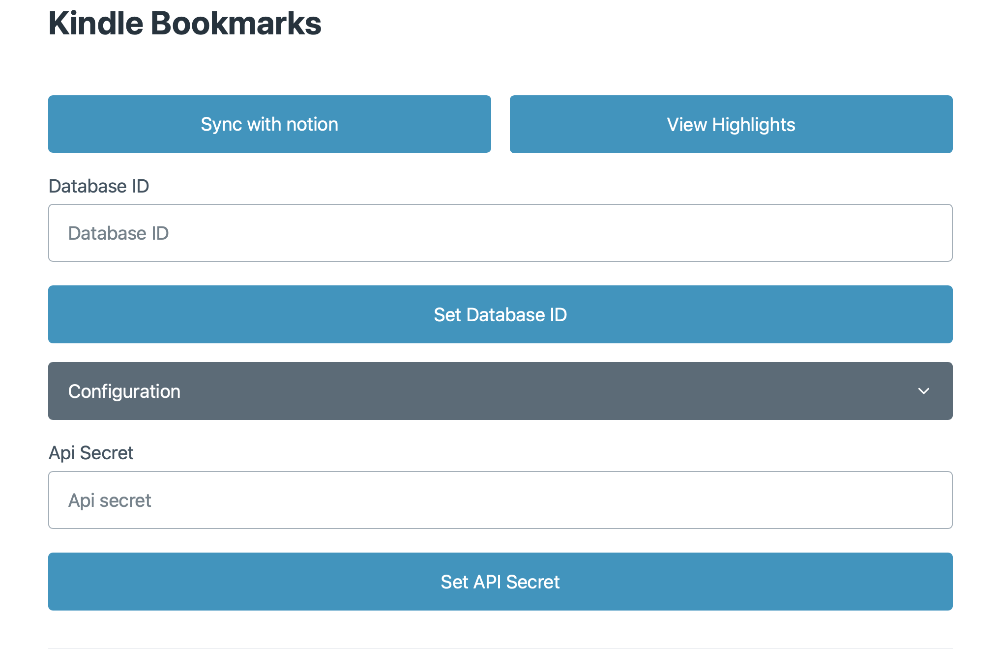
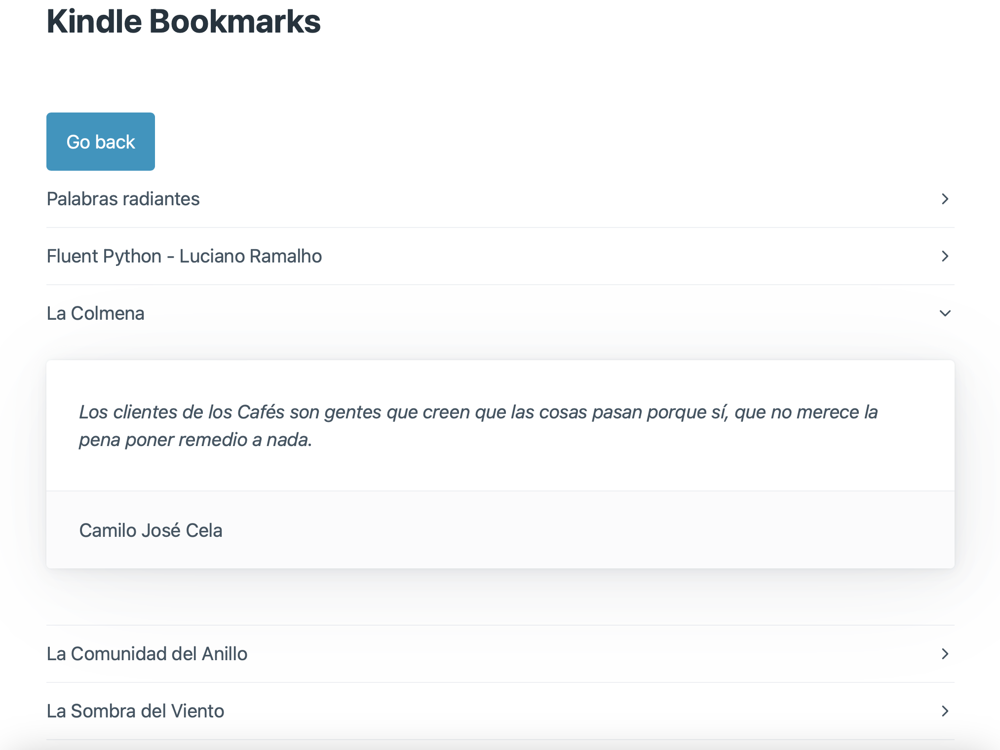

# Kindle Bookmarks

## Overview

The Kindle Bookmarks is an application built using Go and the Wails framework. This tool enables users to detect Kindle devices connected to their computer and scrape the highlights from their Kindle e-books. It also provides the functionality to visualize these highlights, as well as sync them with Notion by configuring your Notion database ID and API secret.

### Main application


### Visualize Highlights


## Features

- Detect connected Kindle devices.
- Sync your highlights with Notion.
- Retrieve and display your highlights in a user-friendly interface.
- Cross-platform support (Windows, macOS, Linux).

## Installation

### Prerequisites

- Go: Ensure you have Go installed on your system. If not, you can download it from [here](https://golang.org/dl/).

### Install and Run

1. Clone this repository to your local machine:

   ```shell
   git clone https://github.com/your-username/kindle-highlights-scraper.git
   cd kindle_bookmarks
   ```

2. Install the Wails development environment:

   ```shell
   go get github.com/wailsapp/wails/cmd/wails
   ```

3. Build and run the application:

   ```shell
   wails build
   ./cmd/kindle-highlights-scraper
   ```

The application should now be up and running.

## Usage

1. Connect your Kindle device to your computer.

2. Launch the Kindle Bookmarks application.

3. Click the "View Highlights" button to retrieve the highlights from your Kindle e-books.

4. Visualize your highlights within the application.

6. To sync your highlights with Notion:
   - Configure your Notion database ID and API secret in the application settings.
   - Click the "Sync with Notion" button to transfer your highlights to your Notion database.

## Configuration

To configure your Notion integration, you can enter your Notion database ID and API secret.

## Support

For any questions, issues, or feedback, please feel free to [create an issue](https://github.com/luiherch/kindle_bookmarks/issues) on the project's GitHub repository.

## License

This project is licensed under the CC BY-NC 4.0 License. See the [LICENSE](LICENSE) file for more information.

## Contributing

Contributions are welcome! If you'd like to contribute to this project, please follow our [Contribution Guidelines](CONTRIBUTING.md).

## Acknowledgments

- This project was inspired by HolyCristis and the love for reading that she spreads.

Thank you for using the Kindle Bookmarks program! Enjoy managing your Kindle highlights and syncing them with Notion.